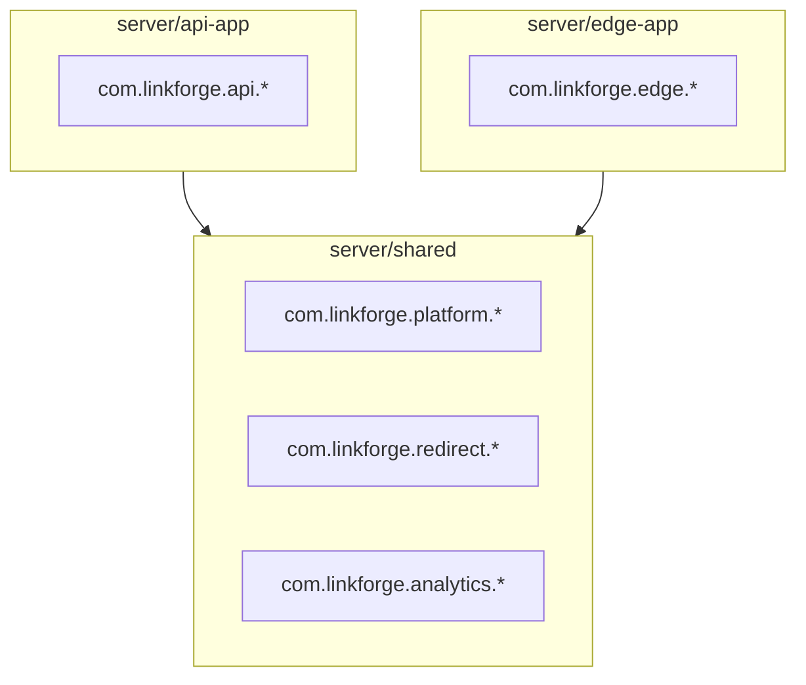

# 变更提案: package-ownership-refactor

## 元信息
```yaml
类型: 重构
方案类型: implementation
优先级: P0
状态: 已确认
创建: 2026-02-24
```

---

## 1. 需求

### 背景
当前后端采用 Maven 多模块（`server/shared` + `server/api-app` + `server/edge-app`），但在 Java 包结构上存在**同名 package 分布在多个 Maven module** 的情况（split package）。

split package 在 Java classpath 下“通常仍能编译运行”，但它会带来长期结构性风险：
- **包归属不清**：同名 package 到底属于哪个产物不明确，导致“该把类放哪/该依赖谁”持续争论与漂移。
- **依赖方向更难治理**：当 shared 与 app 同时拥有同名 package 时，很容易出现隐式耦合与边界侵蚀。
- **未来模块化阻碍**：一旦引入更严格的隔离（JPMS/原生镜像/更强的构建检查/shade relocate），split package 会成为硬阻碍。

本仓库当前存在的 split package（可复核，节选）：
- `com.linkforge.analytics.service.*` 同时存在于：
  - `server/shared/src/main/java/com/linkforge/analytics/service/AnalyticsKeys.java`
  - `server/api-app/src/main/java/com/linkforge/analytics/service/AnalyticsFlushJob.java`
- `com.linkforge.redirect.service.*` 同时存在于：
  - `server/shared/src/main/java/com/linkforge/redirect/service/LinkMeta.java`
  - `server/edge-app/src/main/java/com/linkforge/redirect/service/RedirectService.java`
- `com.linkforge.platform.*` 同时存在于：
  - `server/shared/src/main/java/com/linkforge/platform/api/ApiResponse.java`
  - `server/api-app/src/main/java/com/linkforge/platform/security/SecurityConfig.java`

同时，知识库文档对 `shared` 的定位是“跨服务 SSOT（错误码/响应体/RequestId/配置约定等）”，但目前 `shared` 中也包含了应用侧的实现与 Spring `@Service`（例如 `AnalyticsService`），造成边界含混，文档与代码存在漂移。

### 目标
- **目标1（P0）**：消除后端模块间的 split package（shared/api-app/edge-app 之间同名 package 不再重复出现）。
- **目标2（P0）**：建立并落地“package ownership”规则：每个 Java package 必须有唯一归属模块。
- **目标3（P1）**：将应用侧实现（controller/job/config/repository 等编排类）收敛到应用前缀包中（`com.linkforge.api.*` / `com.linkforge.edge.*`），提高可读性与可维护性。
- **目标4（P1）**：引入防回归机制（CI 检查），避免未来再次出现 split package。

### 约束条件
```yaml
时间约束: 本次允许大范围重构（用户允许短期不稳定）
性能约束: 不以性能优化为目标，但不得引入明显的性能倒退
兼容性约束: 对外 HTTP 路由与主要行为尽量保持不变（/api/v1/**、/r/**）
业务约束: 不调整 Maven modules（不新增、不合并），以“包归属重构”为主
```

### 验收标准
- [ ] **split package 为 0（硬指标）**：`server/shared`、`server/api-app`、`server/edge-app` 的 `src/main/java` 中，任意 `package xxx;` 只允许出现在一个模块。
- [ ] **后端可编译/可测试**：`cd server && mvn -B test` 通过（至少保证编译与现有测试体系可运行）。
- [ ] **关键链路可启动**：API 与 Edge 均能启动（重点回归：Edge `/r/{code}`、API `/api/v1/**` 基础路由；关注 Spring Bean 装配与配置绑定）。
- [ ] **防回归机制上线**：CI/构建流程中存在 split package 检测步骤（检测到重复 package 直接失败）。

---

## 2. 方案

### 技术方案
采用“方案 A：保持 Maven 模块不变，仅通过包名归属消除 split package”（高性价比、风险可控）。

核心策略：把**应用侧实现与编排**迁移到应用前缀包，shared 只保留“可复用能力/契约”。

#### 2.1 Package Ownership 规则（落地即硬规则）
- `server/shared`：拥有平台与跨服务契约能力（`com.linkforge.platform.*`、`com.linkforge.analytics.*`（核心工具/契约）、`com.linkforge.redirect.*`（共享模型/缓存等）），不得放入仅属于某个应用的 controller/job/wiring。
- `server/api-app`：所有应用侧实现落入 `com.linkforge.api.*`（示例：`com.linkforge.api.analytics.*`、`com.linkforge.api.shortlink.*`、`com.linkforge.api.iam.*`、`com.linkforge.api.security.*`、`com.linkforge.api.scheduling.*`）。
- `server/edge-app`：所有应用侧实现落入 `com.linkforge.edge.*`（示例：`com.linkforge.edge.redirect.*`、`com.linkforge.edge.risk.*`、`com.linkforge.edge.net.*`、`com.linkforge.edge.web.*`、`com.linkforge.edge.analytics.*`）。

#### 2.2 本次迁移清单（核心）
- API 侧：
  - `com.linkforge.analytics.*` → `com.linkforge.api.analytics.*`
  - `com.linkforge.platform.security.*` → `com.linkforge.api.security.*`
  - `com.linkforge.platform.scheduling.*` → `com.linkforge.api.scheduling.*`
  - `com.linkforge.shortlink.*` → `com.linkforge.api.shortlink.*`
  - `com.linkforge.iam.*` → `com.linkforge.api.iam.*`
- Edge 侧：
  - `com.linkforge.redirect.*`（edge-app 内的实现）→ `com.linkforge.edge.redirect.*`
- shared 侧（边界收敛）：
  - 将 `server/shared` 中的 `AnalyticsService`（Redirect 侧写 Redis 的实现）迁移到 `edge-app`（`com.linkforge.edge.analytics.*`），避免 shared 携带应用侧 `@Service` 实现导致边界漂移。

#### 2.3 防回归：split package CI 检测
新增一个轻量脚本/检查步骤：扫描 `server/*/src/main/java` 的 package 声明，检测同名 package 是否出现在多个模块；若出现则 CI 失败。

### 影响范围
```yaml
涉及模块:
  - server/shared: 迁移/调整 analytics 相关实现归属（移出 AnalyticsService）
  - server/api-app: 大量 package 迁移（analytics/iam/shortlink/security/scheduling）+ 相关测试/配置引用更新
  - server/edge-app: redirect 包迁移 + 引入 edge 专属 analytics recorder
  - .github/workflows: 增加 split package 检测步骤
  - .helloagents/wiki: 更新架构与模块文档（与代码对齐）
预计变更文件: 30~120（取决于迁移范围与测试覆盖调整）
```

### 风险评估
| 风险 | 等级 | 应对 |
|------|------|------|
| 旧包名遗留（漏改少量类导致 split package 仍存在） | 高 | 引入自动检测（CI/脚本）作为硬闸门；迁移后全仓搜索旧包名前缀 |
| Spring Bean 装配异常（扫描/条件/配置绑定变化） | 中 | 迁移后优先跑 `mvn test`；重点检查 `@SpringBootApplication(scanBasePackages=...)`、`@EnableJpaRepositories/@EntityScan`、`@ConfigurationProperties` 绑定 |
| 迁移 PR 噪声大、冲突多 | 中 | 推荐单 PR 串行推进，按领域拆 commit（analytics→redirect→platform/security→其他） |
| 基于 FQCN 的字符串引用/反射配置未同步更新 | 中 | 全仓 grep 旧 FQCN；重点看配置文件、序列化、指标维度、日志聚合与测试 |

---

## 3. 技术设计（可选）

> 本方案不改变对外 API 路由与数据模型，主要是代码组织与依赖边界治理。

### 架构设计


### API设计 / 数据模型
- 无变更（仅迁移实现代码的 package 与归属）。

---

## 4. 核心场景

> 执行完成后同步到对应模块文档

### 场景: split package 检测阻断
**模块**: CI / 构建检查
**条件**: 任意两个 Maven module 的 `src/main/java` 出现同名 `package xxx;`
**行为**: 检测脚本输出重复 package 清单并退出非 0
**结果**: CI 失败，阻止 merge，迫使在代码层面维护 package ownership

---

## 5. 技术决策

> 本方案涉及的技术决策，归档后成为决策的唯一完整记录

### package-ownership-refactor#D001: 采用“包归属重构（不改 Maven modules）”优先消除 split package
**日期**: 2026-02-24
**状态**: ✅采纳
**背景**: split package 造成模块边界不清、长期治理困难，并与知识库对 shared 的定位存在漂移。
**选项分析**:
| 选项 | 优点 | 缺点 |
|------|------|------|
| A: 保持 Maven modules 不变，仅迁移包归属（推荐） | 成本低、收益直接、可快速落地 split package=0 | 主要是搬家噪声，需防回归 |
| B: 按能力域拆新 Maven modules | 边界最清晰，可进一步治理依赖 | 成本与风险更高，易引入循环依赖/装配问题 |
| C: 全量“每模块一个包根”前缀化 | 边界最硬、最直观 | 变更面最大，冲突与回归风险高 |
**决策**: 选择方案 A
**理由**: 当前 split package 点集中且可外科修复；先以最小成本落地“可执行的边界”，再按需增量推进模块拆分。
**影响**: 后端三模块（shared/api-app/edge-app）包结构与测试；CI 新增硬闸门；知识库文档更新对齐。
