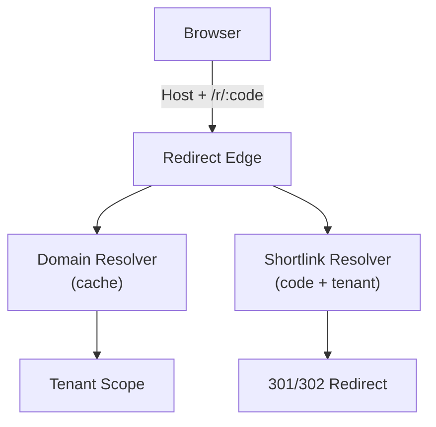

# 变更提案: shortlink-core-gap-analysis

## 元信息
```yaml
类型: 优化
方案类型: overview
优先级: P0
状态: 定稿
创建: 2026-02-25
```

---

## 1. 需求

### 背景
LinkForge 目前作为短链系统 MVP，核心链路已具备且实现形态清晰（API Service + Redirect Edge Service + shared）：  
- 多租户 + JWT + RBAC + API Key（OpenAPI）  
- 短链 CRUD（有效期/标签/归档/删除/导入导出/可选自定义短码/跳转策略字段）  
- Edge `/r/{code}` 跳转（缓存 + 负缓存、301/302、404/410 HTML、预览确认页、query 透传策略、可信代理链、安全取 IP、IP 黑白名单、Redis 限流、bot 降频）  
- 统计（PV/UV/维度/访问事件：Redis → API jobs → MySQL）  
- Vue3 管理台（登录/短链管理/统计看板）

但从“面向公网、可品牌化、可规模化”的短链平台视角看，当前存在一个明确的阻断性缺口：**自定义域名能力链路尚未出现**。  
具体包括（基于代码事实）：未见自定义域名/域名验证/按 Host 区分路由或租户/证书管理；`shortUrl` 生成依赖 `app.base-url`（`APP_BASE_URL`）这一单一配置，缺少多域名输出与运行时 Host 路由能力。

因此需要一份“短链系统核心缺口概述”，用于把缺口按 P0/P1/P2 分级，并说明原因与影响，作为后续进入实施阶段（~auto）时的输入与验收依据。

### 目标
- 输出缺口清单（P0/P1/P2），并明确每条缺口的“原因 → 影响”。  
- 对 P0 缺口给出可验证验收要点（接口/UI/跳转行为/日志指标均可）。  
- 避免把推断当事实：仅把“已确认缺失/已确认存在”的结论写为确定项，其余用“待确认”标注。

### 约束条件
```yaml
时间约束: 本方案包为 overview 概述文档，不进入开发实施；不产生业务代码变更。
性能约束: 仅提出方向性要求：Host 路由与域名解析必须可缓存，不能显著拖慢 /r/{code} 跳转链路（具体指标待实施方案定义）。
兼容性约束: 兼容现有 /r/{code} + 统计链路；未绑定自定义域名的短链仍使用 APP_BASE_URL 作为 fallback。
业务约束: 域名必须进行所有权验证；未验证域名不得启用；域名配置必须可回滚/可暂停。
```

### 验收标准
- [ ] 本文档包含 LinkForge 现状对齐（已实现能力 + 已确认缺失能力），并按 P0/P1/P2 输出缺口清单。  
- [ ] 每个缺口条目包含：缺什么、为什么重要（优先级理由）、不做的影响。  
- [ ] P0 缺口给出可验证验收要点（后续可通过接口/UI/跳转行为/日志指标验证）。  
- [ ] 未在上下文中确认的点以“待确认/待代码核对”标注，不把推断当事实。  

---

## 2. 方案

### 技术方案
本方案包为 overview：不拆实施任务，只把“缺口 → 推荐方向”讲清楚，便于后续进入实施阶段时快速落地。

#### 缺口清单（按优先级）

**P0（阻断项：没有就很难形成“可对外投放”的短链平台）— 自定义域名能力闭环**  
- 缺口：自定义域名资源模型（domain ↔ tenant 绑定）与管理入口  
  - 为什么：没有“可控对象”就无法安全运维、回滚与审计；平台只能停留在单域名形态。  
  - 影响：无法满足品牌短链/客户自带域名；在投放平台审核与用户信任上天然吃亏；域名变更只能人工介入。  
- 缺口：域名所有权验证（DNS TXT/CNAME 或 HTTP challenge）  
  - 为什么：自定义域名是高风险入口能力；没有验证会导致“域名劫持式绑定”。  
  - 影响：严重安全风险（钓鱼/品牌/法律）；无法自助接入，只能依赖人工操作。  
- 缺口：Edge 按 Host 路由与隔离（Host → domain → tenant scope）  
  - 为什么：域名上线后的运行时前提；Host 同时是隔离边界与缓存维度。  
  - 影响：即使有域名配置也“用不起来”；更严重的是可能出现跨租户命中、统计串租等风险。  
- 缺口：HTTPS/证书交付路径（至少确定一条可用路径）  
  - 为什么：生产投放基本等价于必须 HTTPS；证书生命周期（签发/续期/失败告警）是可用性底线。  
  - 影响：接入失败率高、证书到期导致域名整体不可用、不可规模化。  
  - 备注：证书终止位置取决于基础设施（Ingress/LB 托管 vs Edge 自管），需后续明确。  
- 缺口：`shortUrl` 生成从“单一 app.base-url”演进为“多域名策略（tenant 默认域名 / link 绑定域名 / fallback）”  
  - 为什么：当前输出 shortUrl 的来源是静态配置，无法反映域名绑定。  
  - 影响：UI/导出/回显与真实访问入口不一致；域名上线后用户体验割裂。

**P1（增强项：让系统更像“产品”，降低使用成本并提高可运营性）**  
- 缺口：可观测性补齐（按租户/域名维度的核心指标 + 告警）  
  - 为什么：域名与证书引入后，故障形态更偏运维事故；没有指标就只能靠用户报障。  
  - 影响：故障发现慢、定位慢、恢复慢；影响面扩大。  
  - 现状：已有 RequestId、部分 Micrometer 指标与 Actuator；未见分布式 Trace。  
- 缺口：API 侧安全治理（登录/注册防爆破、API Key 配额/限流）  
  - 为什么：Edge 已有风控，但管理面/API Key 同样是攻击入口。  
  - 影响：爆破与滥用风险、资源耗尽、噪音告警。  
- 缺口：审计日志（关键管理动作可追溯）  
  - 为什么：多租户系统的基本治理能力；与域名/证书等高风险操作强相关。  
  - 影响：安全事件难追责、运维误操作难复盘。  
- 缺口：运营效率工具（活动/渠道视图、UTM 模板、分享报表）  
  - 为什么：你们已有 query 透传与统计基础，但缺少“营销可用”的上层工作流。  
  - 影响：用户仍在表格里手拼参数，复盘难扩散，产品粘性不足。

**P2（扩展项：提高天花板与企业化能力，视产品路线选择）**  
- 高级跳转策略（A/B、按地域/设备策略、轮询/权重）、更强的反作弊/内容治理  
- 对外集成（Webhooks、数据仓库导出、广告平台回传/转化跟踪）  
- 企业能力（SSO/SCIM、细粒度权限、合规与数据保留策略、通配符证书/自带证书等）

### 影响范围
```yaml
涉及模块:
  - api-service: 域名管理 API、短链输出 shortUrl 策略、鉴权与审计、配额治理
  - redirect-edge: Host 路由、域名缓存、证书/入口策略、按域名维度的观测与风控
  - admin-ui: 域名管理入口、活动/渠道工作流、报表分享能力
  - deploy: 证书终止与反代（Nginx/Ingress）策略落地
预计变更文件: 待评估（预计 20+，取决于证书与路由方案）
```

### 风险评估
| 风险 | 等级 | 应对 |
|------|------|------|
| 域名劫持/误绑导致的安全事故 | 高 | 强制所有权验证；域名状态机；操作审计；默认禁用直至 verified |
| 证书自动化与续期失败导致域名不可用 | 高 | 明确证书终止策略；证书到期前告警；失败自动降级/暂停域名 |
| Host 路由引入的边缘链路延迟上升 | 中 | 域名映射缓存；热点保护；观测 p95；必要时分层缓存（本地+Redis） |
| 配置变更误操作（域名/路由/证书） | 中 | 版本化与回滚；灰度发布；域名级一键暂停 |
| 统计维度扩展导致数据基数膨胀 | 中 | 域名维度谨慎引入；必要时只做“域名→租户”映射而不落全量明细 |

---

## 3. 技术设计（可选）

> 本方案包为 overview：仅给出方向性草图。具体 API/DB 迁移/回归用例需在进入实施方案包后补齐。

### 架构设计


### API设计
#### POST /api/v1/domains（建议）
- **请求**: { hostname, verificationMethod? }
- **响应**: { domainId, status, verificationInstructions }

#### POST /api/v1/domains/{domainId}/verify（建议）
- **请求**: {}
- **响应**: { status, verifiedAt?, errorReason? }

> 说明：接口路径仅作为建议命名，需与现有路由风格对齐并补齐鉴权与 RBAC。

### 数据模型
| 字段 | 类型 | 说明 |
|------|------|------|
| id | bigint/uuid | 域名记录ID |
| tenant_id | bigint | 归属租户 |
| hostname | varchar | 域名（不含协议） |
| status | enum | pending/verified/active/disabled（示例） |
| verification_method | enum | dns_txt/http（示例） |
| verification_token | varchar | 验证令牌 |
| verified_at | datetime | 验证通过时间 |
| cert_status | enum | issuing/active/failed/unknown（示例，取决于证书方案） |
| created_at | datetime | 创建时间 |
| updated_at | datetime | 更新时间 |

---

## 4. 核心场景

> 执行完成后同步到对应模块文档

### 场景: 租户接入自定义域名并完成验证
**模块**: admin-ui + 域名管理 API（待实现）  
**条件**: 租户已创建且具备管理权限（现有 RBAC/JWT 能力已确认）  
**行为**:
- 租户提交 `hostname`，系统生成验证指引（DNS TXT 或 HTTP challenge）
- 租户按指引配置后触发验证
- 验证通过后域名进入可启用状态  
**结果**:
- 域名状态可查询（pending/verified/active...）
- 未验证域名不可启用、不可用于生成 shortUrl

### 场景: Edge 根据 Host + code 正确解析并跳转
**模块**: redirect-edge  
**条件**: 请求携带 Host；Host 已 verified 且 active；短链可用（未过期/未归档/未禁用）  
**行为**:
- Edge 先按 Host 查域名映射（缓存）
- 得到 tenant scope 后再按 `(tenant, code)` 查短链并执行 301/302  
**结果**:
- 同一 `code` 在不同 Host 下不会串租户/串统计
- 未知 Host 返回统一 404（不暴露租户信息）

### 场景: 生成 shortUrl 时优先使用短链绑定域名
**模块**: api-service（shortlink）  
**条件**: 创建/更新短链时可选择 domain（或采用租户默认域名）  
**行为**:
- 若短链绑定自定义域名，则 `shortUrl` 使用该域名
- 否则 `shortUrl` 使用 `APP_BASE_URL` fallback  
**结果**:
- UI/导出/回显与实际访问入口一致

---

## 5. 技术决策

> 本方案涉及的技术决策，归档后成为决策的唯一完整记录

### shortlink-core-gap-analysis#D001: 域名所有权验证方式
**日期**: 2026-02-25
**状态**: ✅采纳
**背景**: 自定义域名属于高风险入口能力；未验证会带来域名劫持/钓鱼/品牌风险。需要兼顾安全性与接入成本的验证方式。
**选项分析**:
| 选项 | 优点 | 缺点 |
|------|------|------|
| A: 仅 DNS TXT/CNAME | 覆盖面广；不依赖应用回源；安全性高 | 上手门槛较高；DNS 生效有延迟 |
| B: 仅 HTTP challenge | 相对用户友好；可快速验证 | 需要明确回源与路由规则；对基础设施依赖更强 |
| C: DNS + HTTP 双方式 | 兼顾覆盖与体验；可按场景选择 | 实现复杂度更高；需要更完整的状态机与指引文案 |
**决策**: 选择方案 C（DNS + HTTP 双方式），并强制“未验证不可启用”。  
**理由**: 双方式能显著降低接入摩擦，同时保持安全底线；验证通过后才能进入证书与 Host 路由链路。  
**影响**: admin-ui 需要接入向导与状态；api-service/edge-app 需要识别 verified/active 状态；证书签发流程以 verified 为前置条件。  
