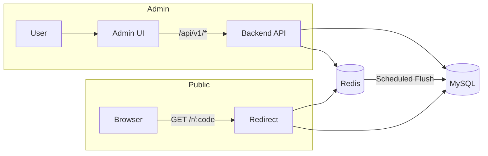

# Technical Design: shortlink_system_mvp（短链系统 MVP）

## Technical Solution

### Core Technologies
- 后端：Java 21、Spring Boot 3.x、Spring Web、Spring Security、Spring Data JPA
- 数据库：MySQL 8.x
- 缓存与统计：Redis 7.x
- 数据迁移：Flyway（建议）
- 前端：Vue 3、Vite、TypeScript（管理后台）
- 文档与调试：OpenAPI/Swagger UI（建议集成）

### Implementation Key Points
- 多租户隔离：`tenant_id` 字段 + 服务端强制注入（TenantContext），禁止越权访问
- 短码生成：Snowflake 64-bit ID → Base62 编码；支持可选自定义短码（校验冲突）
- Redirect 高性能链路：
  - Cache-aside：Redis 命中则直接跳转；未命中回源 MySQL 并写回 Redis
  - 默认 302：避免浏览器/代理永久缓存影响可控性与统计
- 统计采集与聚合：
  - Redirect 侧只做轻量写入 Redis（PV 计数 + UV 近似去重结构）
  - 定时任务聚合落库（按天）到 MySQL 统计表
  - 预留 MQ/OLAP 扩展点（Kafka + ClickHouse）以应对更大规模分析需求

---

## Domain / Short Code / Redirect 建议（落地选型）

### 域名建议
- 推荐“跳转域名”与“管理后台域名”分离：
  - Redirect：`s.example.com`（仅提供 `/r/{code}`）
  - Admin UI：`console.example.com`
  - API：`api.example.com`（或与 console 同域但不同路径）
这样可以避免前端路由与短码路径冲突，并便于 CDN/缓存策略区分。

### 短码建议
- 默认：`base62(snowflakeId)`，长度通常为 10~11 位（稳定、全局唯一、无碰撞）
- 可选增强：支持 7~9 位随机短码（需冲突检查与重试；实现复杂度更高）

### 跳转状态码建议
- 默认 302（推荐）：便于后续调整原始 URL、失效策略与统计准确性
- 可选 301：仅在“永久不变”的链接场景启用（需提示用户缓存风险）

---

## Architecture Design



---

## Architecture Decision ADR

### ADR-001: 短码生成采用 Snowflake + Base62
**Context:** 需要在分布式场景下生成全局唯一短码，并避免数据库自增成为单点瓶颈。  
**Decision:** 使用 Snowflake 生成 64-bit ID，并进行 Base62 编码作为短码；允许可选自定义短码（校验冲突）。  
**Rationale:** 生成速度快、无中心化依赖、短码可预测长度、实现成熟。  
**Alternatives:** 随机短码（7~9 位） → 拒绝原因：需要冲突重试与更复杂的唯一性保证。  
**Impact:** 短码长度通常 10~11；若未来强诉求更短，可新增随机策略并做灰度切换。

### ADR-002: Redirect 采用 Redis Cache-aside，默认 302
**Context:** Redirect QPS 高，数据库回源成本高；同时需要保留可控性与统计准确性。  
**Decision:** Redis 作为解析缓存，未命中回源 MySQL 并写回；跳转默认 302。  
**Rationale:** 读性能优先，且 302 避免永久缓存导致不可控与统计缺失。  
**Alternatives:** 默认 301 → 拒绝原因：缓存不可控，后续变更与统计更困难。  
**Impact:** 需要处理缓存一致性（更新/禁用/到期时主动失效或缩短 TTL）。

### ADR-003: 统计采用 Redis 聚合 + 定时落库（按天）
**Context:** 亿级规模下不适合每次跳转写 MySQL 明细；但 MVP 需要可用报表。  
**Decision:** Redirect 侧写 Redis 计数/去重结构；定时任务聚合写入 `link_stats_daily`。  
**Rationale:** 写放大小、成本低、可演进到 MQ/OLAP。  
**Alternatives:** MySQL 同步写明细 → 拒绝原因：写入压力与存储成本过高，且影响跳转延迟。  
**Impact:** 统计为“最终一致”，UV 可近似；若需要精细分析，后续引入 Kafka + ClickHouse。

### ADR-004: 多租户隔离采用 tenant_id 强制注入
**Context:** 需要确保租户数据严格隔离，避免仅靠前端传参带来越权风险。  
**Decision:** 服务端从 JWT/API Key 解析 tenantId，写入 TenantContext；所有仓储查询必须带 tenantId 条件。  
**Rationale:** 强约束可审计、降低越权概率。  
**Impact:** 需要统一的数据访问层约束与代码审计规则。

---

## API Design（草案）

### [POST] /api/v1/links
- **Request:** originalUrl, expiresAt?, note?, tags?, customCode?
- **Response:** id, code, shortUrl, expiresAt, enabled

### [GET] /r/{code}
- **Request:** code path param
- **Response:** 302 Location: originalUrl（或不可用页）

### [GET] /api/v1/stats/links/{id}/daily
- **Request:** from, to
- **Response:** [{ day, pv, uv }]

---

## Data Model（关键表）

```sql
-- short_links（核心字段示意）
CREATE TABLE short_links (
  id BIGINT PRIMARY KEY,
  tenant_id BIGINT NOT NULL,
  code VARCHAR(32) NOT NULL,
  original_url TEXT NOT NULL,
  note VARCHAR(512),
  enabled TINYINT NOT NULL,
  expires_at DATETIME NULL,
  created_by BIGINT NOT NULL,
  created_at DATETIME NOT NULL,
  updated_at DATETIME NOT NULL,
  UNIQUE KEY uk_short_links_code (code),
  KEY idx_short_links_tenant_created_at (tenant_id, created_at)
) ENGINE=InnoDB;

-- link_stats_daily（按天聚合）
CREATE TABLE link_stats_daily (
  link_id BIGINT NOT NULL,
  tenant_id BIGINT NOT NULL,
  day DATE NOT NULL,
  pv BIGINT NOT NULL,
  uv BIGINT NOT NULL,
  updated_at DATETIME NOT NULL,
  PRIMARY KEY (link_id, day),
  KEY idx_stats_tenant_day (tenant_id, day)
) ENGINE=InnoDB;
```

---

## Security and Performance

- **Security:**
  - 密码哈希：bcrypt/argon2（禁止明文存储）
  - JWT/Key：禁止日志输出敏感信息；API Key 仅保存哈希
  - 输入校验：originalUrl 仅允许 `http/https`，限制长度与字符集
  - 多租户与 RBAC：服务端强制校验 tenantId/role
- **Performance:**
  - Redirect 优先 Redis 命中；设置合理 TTL 与失效策略
  - 统计最终一致：Redis 聚合 + 批量落库
  - MySQL 索引与连接池配置；关键查询只走索引

---

## Testing and Deployment

- **Testing:**
  - 单元测试：短码生成、权限校验、URL 校验
  - 集成测试：MySQL/Redis（Testcontainers）
  - Redirect 压测：验证 QPS 1000 下延迟与错误率
- **Deployment:**
  - Docker Compose：MySQL + Redis + server + web
  - CI：后端编译/测试、前端构建、镜像构建（可选）
