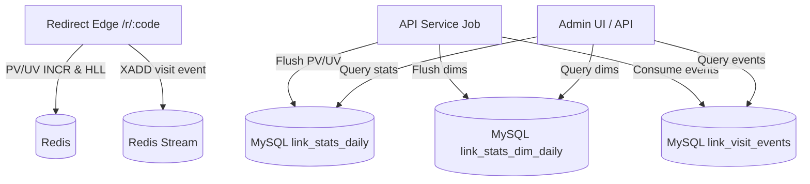

# 技术方案设计：P1 统计维度与访问明细增强（A+B）

## 技术方案

### 核心技术
- **Backend：** Spring Boot 3.2.x（Edge / API 多模块）
- **Cache/Queue：** Redis（现有 PV/UV；新增 Redis Stream 用作事件缓冲）
- **DB：** MySQL（现有 `link_stats_daily`；新增维度聚合表与短期明细事件表）

### 实现要点

#### 1) 采集层（Edge）增强：扩展 VisitInfo + 维度归一化
- 扩展 `VisitInfo` 字段：
  - `referer`（或归一化后的 `refererDomain`）
  - `acceptLanguage`（或归一化后的 `primaryLanguage`）
  - 渠道参数（UTM 等，建议只采集白名单：`utm_*`/`gclid`/`fbclid` 等）
- 维度归一化规则（避免高基数）：
  - `referer`：仅保留 `scheme://host` 或 `host`（推荐 `host`），忽略 path/query
  - `accept-language`：解析并保留第一个 language tag（如 `zh-CN`/`en`）
  - `user-agent`：解析为有限枚举/家族（browser_family/os_family/device_type）；如引入第三方解析库需记录版本与风险

#### 2) 维度聚合（A 的落地）：Redis 计数 + Flush 到 MySQL
- 在 Edge 侧对每次访问：
  - 对维度计数做 `INCR`
  - 对维度 UV 做 HLL（可选，优先支持 PV，UV 后续补齐）
  - 维护“维度活跃索引集合”，避免 flush 全量扫描 keyspace
- API 侧新增定时 flush job：
  - 以“活跃链接集合 + 维度活跃集合”为输入
  - 批量读取 PV/UV，写入按天维度聚合表

#### 3) 访问明细事件（B）：Redis Stream → API 消费落库 → MySQL（短期留存）
- **Edge：** 将访问事件写入 Redis Stream（`XADD`）：
  - 写入字段：`ts`、`tenantId`、`linkId`、`requestId`、`ip_hash`、`ua_raw`、`ua_family`、`referer_domain`、`language`、`utm_*` 等
  - 使用 `MAXLEN ~ N` 做近似截断，限制内存
  - 支持 `sampleRate`（例如 0.1 或按 QPS 动态降采样）
  - 失败必须吞掉异常（不影响跳转）
- **API：** 新增消费作业：
  - 使用 consumer group 读取 stream，批量 insert
  - 至少一次语义；通过 `(tenantId, requestId)` 唯一约束或幂等键避免重复写入
- **留存清理：** 新增按天清理作业（delete where created_at < now - retentionDays）

## 架构设计（逻辑视图）



## 架构决策 ADR

### ADR-001：访问明细采用 Redis Stream 缓冲 + MySQL 短期留存
**Context：** 需要“最近访问明细”支撑排障与异常识别，但不能在 Edge 主链路引入高写放大或强依赖外部队列。

**Decision：**
- Edge 使用 Redis Stream 作为事件缓冲（可采样、限长、失败吞掉）。
- API Service 以定时作业消费 stream，批量落库到 MySQL 明细表。
- 明细表做短期留存（默认 7/14 天），避免长期膨胀。

**Rationale：**
- 复用现有 Redis 组件，接入成本低；
- 与“跳转主链路不被统计拖垮”的约束一致（best-effort）；
- 明细仅用于排障与近期分析，短期留存可控。

**Alternatives：**
- 直接在 Edge 每次跳转写 MySQL 明细 → 拒绝原因：写放大过大，主链路风险高。
- Kafka/ClickHouse/对象存储 → 拒绝原因：引入新基础设施成本高，本期不合适（可作为后续演进）。

**Impact：**
- 需要新增 stream 消费作业与幂等处理；
- 需要新增留存清理作业与运维观测（积压、丢弃、采样率）。

### ADR-002：维度报表优先使用“按天维度聚合表”
**Context：** 运营报表需要快速查询维度分布，若完全依赖明细表 group-by，随着访问量增长会出现查询慢与资源竞争。

**Decision：**
- 维度分布优先落到按天聚合表（MySQL），API 查询直接读聚合表。
- 明细表主要用于排障/抽样分析，不作为主报表的数据源。

**Alternatives：**
- 仅保留明细表，通过 SQL group-by 得出维度分布 → 拒绝原因：可扩展性差，风险高。

**Impact：**
- 需要新增 Redis 维度计数 key、维度活跃集合与 flush job；
- 维度字段需做严格归一化，避免高基数写放大。

## API 设计（新增）

> 仅开放给管理后台（`!hasRole('OPENAPI')`），与现有 `/api/v1/stats/**` 风格保持一致。

### [GET] /api/v1/stats/links/{id}/dimensions
- **Request：** `from`、`to`、`type`（如 `referer_domain|utm_source|browser_family|language`）、`limit`
- **Response：** `[{value, pv, uv, ratio}]`

### [GET] /api/v1/stats/links/{id}/events
- **Request：** `from`、`to`、`limit`（`from/to` 为 UTC LocalDateTime；缺省范围为最近 1 天）
- **Response：** 最近访问事件列表（脱敏字段 + 归一化维度）

## 数据模型（新增/变更）

> 伪 SQL，仅用于设计说明，最终以 Flyway migration 为准。
> 注意：`occurred_at` 以 **UTC 语义**写入/查询；由于 MySQL `DATETIME` 不带时区，应用侧统一用 `LocalDateTime(UTC)` 传参，避免 JDBC `Timestamp` 发生隐式时区转换导致查询范围不命中。

```sql
-- 访问明细（短期留存）
CREATE TABLE link_visit_events (
  id BIGINT NOT NULL PRIMARY KEY,
  tenant_id BIGINT NOT NULL,
  link_id BIGINT NOT NULL,
  occurred_at DATETIME NOT NULL,
  request_id VARCHAR(64) NOT NULL,
  ip_hash VARCHAR(64) NULL,
  ua_raw VARCHAR(512) NULL,
  ua_family VARCHAR(64) NULL,
  os_family VARCHAR(64) NULL,
  device_type VARCHAR(32) NULL,
  referer_domain VARCHAR(255) NULL,
  language VARCHAR(32) NULL,
  utm_source VARCHAR(128) NULL,
  utm_medium VARCHAR(128) NULL,
  utm_campaign VARCHAR(128) NULL,
  created_at DATETIME NOT NULL DEFAULT CURRENT_TIMESTAMP,
  KEY idx_visit_tenant_link_time (tenant_id, link_id, occurred_at),
  KEY idx_visit_tenant_time (tenant_id, occurred_at),
  UNIQUE KEY uk_visit_tenant_request (tenant_id, request_id)
);

-- 维度聚合（按天 + 维度类型 + 维度值）
CREATE TABLE link_stats_dim_daily (
  tenant_id BIGINT NOT NULL,
  link_id BIGINT NOT NULL,
  day DATE NOT NULL,
  dim_type VARCHAR(32) NOT NULL,
  dim_value VARCHAR(255) NOT NULL,
  pv BIGINT NOT NULL,
  uv BIGINT NOT NULL,
  updated_at DATETIME NOT NULL DEFAULT CURRENT_TIMESTAMP ON UPDATE CURRENT_TIMESTAMP,
  PRIMARY KEY (tenant_id, link_id, day, dim_type, dim_value),
  KEY idx_dim_tenant_day_type (tenant_id, day, dim_type)
);
```

## 安全与性能
- **安全：**
  - 明细事件默认存 `ip_hash`（使用 `app.analytics.salt` 或专用 salt），避免明文 IP 扩散；
  - UTM/Referer 做严格归一化与长度限制，禁止落库完整 URL path/query；
  - 明细/维度查询接口：仅后台角色可访问，必要时增加审计日志。
- **性能：**
  - Edge：写入全部 best-effort，失败吞掉；Stream 使用 `MAXLEN ~` 控制内存；
  - API：消费与 flush 均批量化；对查询增加索引并限制 `limit`；
  - 维度写放大控制：仅采集低基数维度 + UTM 白名单，必要时提供采样与“其他”聚合策略。

## 测试与发布
- **测试：**
  - 单元测试：维度归一化（referer domain / accept-language / utm 提取）、ip_hash 稳定性、幂等键。
  - 集成测试：Redis Stream 消费落库（可用 Testcontainers Redis + MySQL）。
- **发布：**
  - 先上 DB migration（新增表），再灰度发布 API 消费作业；
  - 最后发布 Edge 写入（可通过配置开关逐步开启采样与维度类型）。
