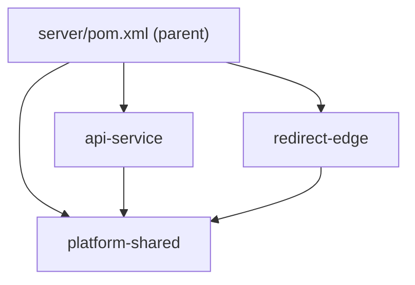

# 变更提案: rename-server-modules

## 元信息
```yaml
类型: 重构
方案类型: implementation
优先级: P1
状态: 定稿
创建: 2026-02-25
```

---

## 1. 需求

### 背景
当前 `server/` 下的目录与 Maven 模块命名偏“工程内部”风格：`api-app`、`edge-app`、`shared`、`tools`。  
在对外表达、文档一致性、以及日常操作（例如 `mvn -pl ...`、Docker build context、CI 脚本引用）层面可读性不佳，也不利于后续扩展更多模块（例如 future: worker/job、gateway 等）。

用户已明确希望把模块命名产品化，并将目录名与 Maven 产物名（artifactId/name）同步改为更清晰的含义：
- `api-app` → `api-service`
- `edge-app` → `redirect-edge`
- `shared` → `platform-shared`
- `tools` → `dev-tools`（注意：该目录不是 Maven module，仅脚本目录改名）

本变更属于“结构性重命名”，业务逻辑不变，但影响构建路径与部署脚本引用，必须一次性改全并通过构建验证。

### 目标
- 统一 `server/` 下目录名、Maven module 名称与 artifactId（避免“目录叫新名但构建仍是旧名”）。  
- 同步更新所有引用旧模块名/旧路径的位置（README、deploy、CI、脚本、Dockerfile 等）。  
- 保证本地构建与测试可通过：`mvn -f server/pom.xml test`。  
- 提供清晰回滚路径（如发生遗漏引用导致构建失败，可快速恢复）。

### 约束条件
```yaml
时间约束: 一次性完成重命名并通过测试，避免出现“半改状态”导致团队无法构建。
性能约束: 不涉及运行时性能改动（仅结构重命名）。
兼容性约束: Java package（例如 com.linkforge.api/edge/platform）保持不变；仅调整 Maven module 及目录名称。
业务约束: 不改变现有对外 API 行为与配置语义；仅更新文档/脚本中的启动命令与路径。
```

### 验收标准
- [ ] `server/` 下目录重命名完成：`api-service`、`redirect-edge`、`platform-shared`、`dev-tools` 均存在，旧目录不存在。  
- [ ] `server/pom.xml` 的 `<modules>` 与新目录一致：`platform-shared`、`api-service`、`redirect-edge`。  
- [ ] 各模块 `pom.xml` 的 `artifactId`/`name` 更新完成，且模块间依赖引用同步更新。  
- [ ] 仓库内不再引用旧模块名/路径（至少 `api-app`/`edge-app`/`shared`/`tools` 的关键引用被清理）。  
- [ ] `mvn -f server/pom.xml test` 通过。  
- [ ] `deploy/docker-compose.yml` / README / CI 命令可按新模块名正常工作（至少不包含旧模块名）。  

---

## 2. 方案

### 技术方案
采用“先修改 POM 引用 + 再目录重命名 + 全仓引用替换 + 构建验证”的方式，确保每一步可定位问题：

1) 在代码层面先梳理旧名称出现位置（Maven `<modules>`、`artifactId` 依赖、Docker build context、文档命令等）。  
2) 使用 `git mv` 重命名目录，保持历史与减少误删风险。  
3) 修改 `server/pom.xml` 与各 module 的 `pom.xml`：  
   - `linkforge-api-app` → `linkforge-api-service`  
   - `linkforge-edge-app` → `linkforge-redirect-edge`  
   - `linkforge-shared` → `linkforge-platform-shared`  
   并同步更新依赖引用。  
4) 更新 `deploy/`、`.github/`、README 里引用旧 module 名的命令与路径。  
5) 运行 `mvn -f server/pom.xml test` 验证。  

注：`server/tools` 不是 Maven module，仅包含脚本目录，因此只做目录重命名与引用更新（如有）。

### 影响范围
```yaml
涉及模块:
  - server/pom.xml: reactor modules 列表更新
  - server/api-service: 模块目录与 pom 重命名（原 api-app）
  - server/redirect-edge: 模块目录与 pom 重命名（原 edge-app）
  - server/platform-shared: 模块目录与 pom 重命名（原 shared）
  - server/dev-tools: 脚本目录重命名（原 tools）
  - deploy/: docker compose build context / 启动命令引用更新
  - README.md / .helloagents/wiki: 文档与示例命令同步
预计变更文件: 10~30（取决于引用点数量）
```

### 风险评估
| 风险 | 等级 | 应对 |
|------|------|------|
| 漏改引用点导致构建/部署失败 | 中 | 全仓 rg 搜索旧名；改动后运行 `mvn -f server/pom.xml test`；必要时补一条“旧名清单”核对 |
| Docker 构建产物名变化（artifactId 变更）影响 Dockerfile/compose | 中 | 搜索并同步更新 Dockerfile/compose；用 `docker compose build`（可选）验证 |
| CI/文档命令仍使用 `-pl api-app/edge-app` | 低 | 全仓搜索并替换；在 README 明确新命令 |
| 回滚困难（目录已重命名） | 低 | 使用 git 原子提交（本次不提交，但确保变更集中）；保留映射表（旧→新）供快速回滚 |

---

## 3. 技术设计（可选）

本变更不涉及对外 API/数据模型调整，仅涉及“构建结构与命名”。该章节留空即可。

### 架构设计


### API设计
N/A

### 数据模型
N/A

---

## 4. 核心场景

> 执行完成后同步到对应模块文档

### 场景: 开发者按新模块名运行后端
**模块**: server（Maven reactor）  
**条件**: 代码已拉取最新，Java/Maven 环境可用  
**行为**:
- 在仓库根目录执行：`mvn -f server/pom.xml test`  
- 本地开发运行：
  - `mvn -f server/pom.xml -pl api-service spring-boot:run`
  - `mvn -f server/pom.xml -pl redirect-edge spring-boot:run`  
**结果**:
- 构建与测试通过
- 启动命令不再出现 `api-app/edge-app/shared/tools` 等旧命名

---

## 5. 技术决策

> 本方案涉及的技术决策，归档后成为决策的唯一完整记录

### rename-server-modules#D001: 目录名与 artifactId 同步改名
**日期**: 2026-02-25
**状态**: ✅采纳
**背景**: 仅改目录名会导致 Maven 坐标（artifactId）与目录名不一致；仅改 artifactId 会导致 `-pl`、Docker context、文档等仍困扰。需要一次性同步改名，保证认知一致性。
**选项分析**:
| 选项 | 优点 | 缺点 |
|------|------|------|
| A: 只改目录名 | 改动小，风险低 | Maven 坐标仍旧；文档/脚本不一致；长期更乱 |
| B: 只改 artifactId | Maven 坐标更清晰 | 目录名仍旧；开发/部署/文档仍被旧名污染 |
| C: 目录名 + artifactId 同步改名（选择） | 一次性收敛，认知一致 | 改动面较大，需要全仓核对 |
**决策**: 选择方案 C。  
**理由**: 本次目标是“命名收敛”，需要一步到位；同时通过构建/测试降低遗漏风险。  
**影响**: 需要同步更新 `server/pom.xml`、各模块 `pom.xml`、`deploy/`、README、CI 以及引用旧模块名的脚本。  
