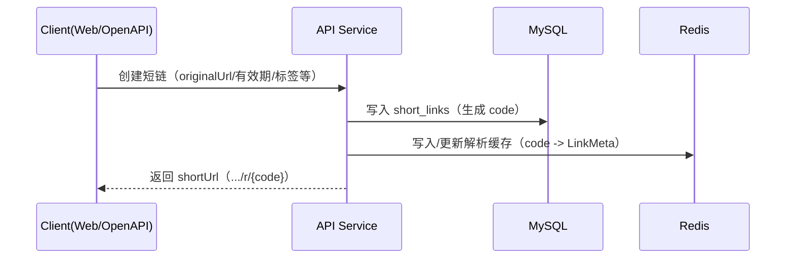
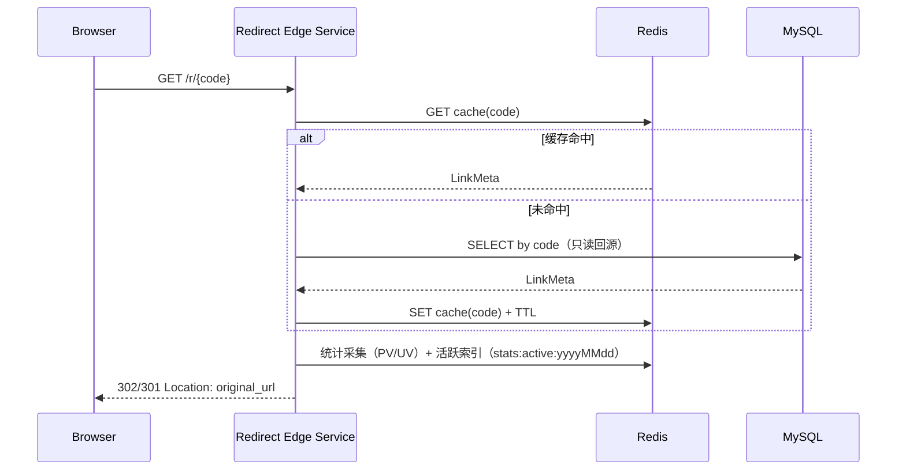

# 架构设计

## 1. 总体架构（API Service + Redirect Edge Service）

LinkForge 将后端拆分为两个可独立部署的 Spring Boot 服务，并通过 `shared` 模块共享跨服务 SSOT（错误码/响应体/RequestId/配置约定等）。

```mermaid
flowchart TD
    U[公网访问者/浏览器] -->|GET /r/{code}| EDGE[Redirect Edge Service<br/>Spring Boot :8081]
    A[租户用户/管理员] -->|Web| W[Admin UI<br/>Vue3 + Nginx :80]
    W -->|/api/v1/*| API[API Service<br/>Spring Boot :8080]
    W -->|/r/*| EDGE

    EDGE -->|读/写缓存| Redis[(Redis)]
    EDGE -->|回源只读查询| DB[(MySQL)]
    EDGE -->|PV/UV 采集 + 活跃索引| Redis

    API --> DB
    API --> Redis
    API -->|定时 Flush（active-set 增量）| DB

    %% Future (optional)
    Redis -.可选扩展.-> MQ[(Kafka / MQ)]
    MQ -.可选扩展.-> OLAP[(ClickHouse / ES)]
```

### 1.1 边界与职责（核心约束）

| 边界 | API Service（`server/api-app`） | Redirect Edge Service（`server/edge-app`） | shared（`server/shared`） |
|------|-------------------------------|-------------------------------------------|---------------------------|
| 路由 | `/api/v1/**` | `/r/**` | 不对外暴露路由 |
| 主要职责 | IAM、短链 CRUD、OpenAPI、统计查询、统计落库（flush job） | 短链解析与跳转、缓存治理、轻量统计写入 | 响应体与错误码、异常、RequestId、统一配置与安全基础类型 |
| 数据访问 | 读写 MySQL（JPA）+ Redis | MySQL **只读回源**（JDBC）+ Redis | 不直接访问 DB（提供公共类型/工具） |
| 性能目标 | 管理后台优先正确性与安全 | 跳转链路优先低延迟与稳定性 | 作为 SSOT，优先稳定与一致性 |

补充约束（代码组织 / 包归属）：
- **shared 是“可复用能力/契约”的唯一归属**：例如 `com.linkforge.platform.*`、`com.linkforge.redirect.*`（`LinkMeta/LinkCacheService`）、`com.linkforge.analytics.*`（`AnalyticsKeys` 作为 Redis key 契约）。
- **应用侧实现必须落入应用前缀包**：
  - API Service：`com.linkforge.api.*`（controller/service/job/config/security 等）
  - Edge Service：`com.linkforge.edge.*`（controller/service/risk/net 等）
- **禁止 split package**：同名 Java package 不得同时出现在多个 Maven module；CI 会在构建阶段检测并阻断回退。

---

## 2. 技术栈（现状对齐）

- 后端：Java **17（当前构建基线）** + Spring Boot 3.2.x（Maven 多模块）
- API Service：Spring Web + Spring Security + Spring Data JPA
- Edge Service：Spring Web + Redis + JDBC（避免引入 JPA，降低启动与依赖复杂度）
- 数据与缓存：MySQL 8.x、Redis 7.x
- 前端：Vue 3、Vite、TypeScript（管理后台）
- 部署：Docker / Docker Compose（`deploy/docker-compose.yml`）；Nginx 统一转发 `/api` 与 `/r`

---

## 3. 核心流程（可观测、可回滚）

### 3.1 创建短链（API Service）



### 3.2 跳转解析（Redirect Edge Service）



补充说明（体验与可控性增强）：
- **不可用体验（Accept 协商）**：当 Accept 包含 `text/html` 时，Edge 对短码不存在返回 404 HTML、禁用/过期返回 410 HTML（可配置落地页跳转）；非 HTML 请求保持 JSON 错误结构。
- **预览页（确认后再跳）**：当链接开启 `previewEnabled=true` 且为浏览器请求时，首次访问返回 200 HTML 预览页；携带 `__lf_confirm=1` 后才跳转并计数。
- **Query 透传策略**：支持 OFF/ALLOWLIST/ALL（按链接优先，其次全局默认）；过滤内部保留字段；冲突策略为“目标 URL 优先”（不覆盖同名参数）。

### 3.3 统计落库（API Service Flush Job，active-set 增量驱动）

设计目标：避免 Redis keyspace 全量扫描（`SCAN stats:pv:*`）带来的 CPU/延迟/不可控风险。

关键点：
- Edge 写入活跃索引集合：`stats:active:{yyyyMMdd}`，成员为 `{tenantId}:{linkId}`
- PV key：`stats:pv:{tenantId}:{linkId}:{yyyyMMdd}`
- UV key：`stats:uv:{tenantId}:{linkId}:{yyyyMMdd}`（HLL 近似去重）
- API Flush Job 仅扫描活跃集合并批量 upsert MySQL，具备降级与幂等能力
- 多实例治理：flush/dim flush/retention 等定时作业通过 ShedLock（Redis）互斥，避免水平扩容导致重复跑任务、重复写库放大
- 可追赶回补：flush 支持按回补窗口（最近 N 天，包含今天）追赶落库，降低部署中断导致“历史缺天”的风险

---

## 4. 加固要点（architecture_hardening，2026-02-24）

> 该阶段聚焦“不推翻现有架构”的前提下补齐护栏：身份一致性、最小权限、安全默认值、统计可控性与契约显式化。
> 方案包归档见：`.helloagents/history/2026-02/202602241741_architecture_hardening/`。

- **IAM 身份一致性：email 全局唯一（P0）**：数据库层增加 `users(email)` 全局唯一约束，避免“登录不携带租户但 DB 允许跨租户同 email”导致的越权/不确定行为。
- **部署最小权限：API/Edge DB 凭证拆分（P1）**：docker compose 默认创建 `linkforge_api`（读写）与 `linkforge_edge`（只读）两套账号，Edge 仅授予读取 `short_links` 的权限。
- **Cookie 模式安全策略：CSRF 双提交 cookie（P1）**：当启用 JWT HttpOnly Cookie 会话模式时，同时启用 CSRF（`XSRF-TOKEN` cookie + `X-XSRF-TOKEN` header），并提供 `GET /api/v1/auth/csrf` 作为前端初始化入口。
- **统计 flush 可控性（P1/P2）**：`AnalyticsFlushJob` 对 UV 的 `PFCOUNT` 查询改为 pipeline 降低 Redis RTT；维度 flush 增加“单次按天处理活跃链接数上限”以控制扫描成本。
- **契约显式化（P2）**：将 `stats:*` Redis key 约定提升为 public contract（`AnalyticsKeys`），并用单测锁定 key 格式，避免跨模块隐式耦合。
- **OpenAPI 写热点治理（P2）**：API Key 认证路径对 `last_used_at` 采用节流写回（默认 300s），避免高 QPS 下 DB 写放大。
- **配置校验去重（P2）**：API/Edge 启动期配置校验的公共规则抽取到 shared（`StartupValidation`），减少长期漂移点。
- **工程卫生（P2）**：Maven `target/` 构建产物不应入库，统一通过 `.gitignore` 忽略并清理。

---

## 5. 重大架构决策（ADR）

> ADR 详情记录在每次变更的方案包 `how.md` 中；执行完成后迁移到 `.helloagents/history/` 并在此处维护索引。

| adr_id | 标题 | 日期 | 状态 | 影响模块 | 详情 |
|--------|------|------|------|----------|------|
| ADR-001 | 短码生成采用 Snowflake + Base62 | 2026-02-18 | ✅Adopted | shortlink / redirect | [how.md](../history/2026-02/202602182227_shortlink_system_mvp/how.md) |
| ADR-002 | Redirect 采用 Redis Cache-aside，默认 302 | 2026-02-18 | ✅Adopted | redirect | [how.md](../history/2026-02/202602182227_shortlink_system_mvp/how.md) |
| ADR-003 | 统计采用 Redis 聚合 + 定时落库（按天） | 2026-02-18 | ✅Adopted | analytics | [how.md](../history/2026-02/202602182227_shortlink_system_mvp/how.md) |
| ADR-004 | 多租户隔离采用 tenant_id 强制注入 | 2026-02-18 | ✅Adopted | iam / shortlink | [how.md](../history/2026-02/202602182227_shortlink_system_mvp/how.md) |
| ADR-005 | 后端拆分 API/Edge + shared SSOT；统计 flush 改为 active-set 增量驱动 | 2026-02-19 | ✅Adopted | api-service / redirect-edge / analytics | [how.md](../history/2026-02/202602191426_edge_api_split_refactor/how.md) |
| ADR-006 | Redirect 不可用场景按 Accept 输出 HTML（仅 /r/**） | 2026-02-20 | ✅Adopted | redirect | [how.md](../history/2026-02/202602201026_redirect_experience_control/how.md) |
| ADR-007 | Query 透传默认 OFF/ALLOWLIST（安全默认），按链接可覆盖 | 2026-02-20 | ✅Adopted | redirect / shortlink | [how.md](../history/2026-02/202602201026_redirect_experience_control/how.md) |
