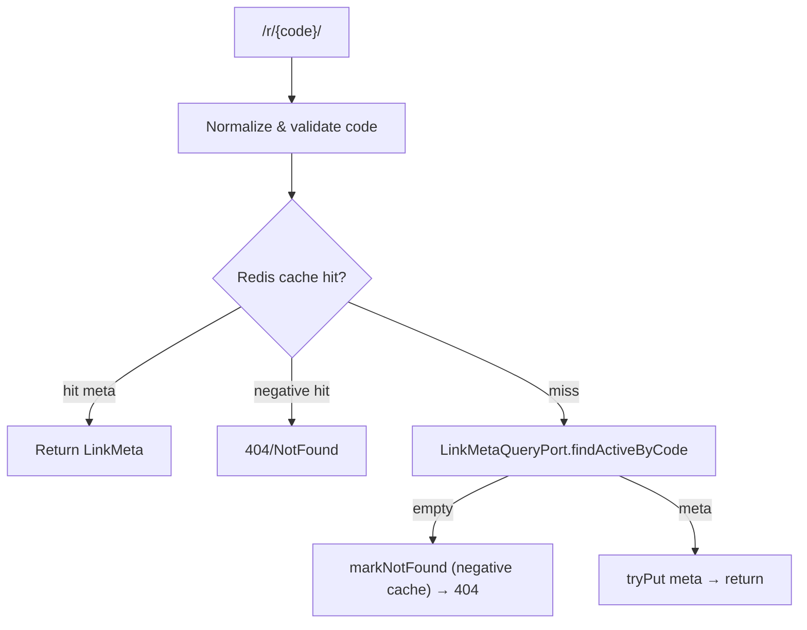

# LinkForge 架构总览

LinkForge 是一个短链系统 MVP，本仓库采用 **Java Spring Boot（后端）+ Vue3（管理后台）** 的单仓（monorepo）结构，并提供：

- 管理 API：`/api/v1/**`（JSON，`ApiResponse` 契约）
- 跳转链路：`/r/**`（浏览器优先，支持 HTML 体验与 JSON 错误）
- 多租户：所有核心资源带 `tenant_id`，并在服务层做越权护栏
- 缓存与统计：Redirect 高 QPS 路径优先走 Redis，异步落库 MySQL

本文聚焦“**当前代码的真实结构与运行链路**”，作为快速上手的架构入口；更细的设计推演与改造计划见 `docs/plans/`。

---

## 1. 仓库结构（Monorepo）

- `deploy/`：一键启动与环境变量示例
  - `deploy/docker-compose.yml`：MySQL + Redis + 后端 + Web（Nginx）组合
  - `deploy/.env.example`：环境变量模板（JWT/Analytics/TrustedProxies 等）
- `server/`：后端（Spring Boot 模块化单体，Maven reactor 多模块）
- `web/`：管理后台（Vue3 + Vite，生产用 Nginx 静态托管并反代后端）
- `bench/`：压测/基准脚本（当前包含 redirect 压测）
- `docs/plans/`：方案与实现计划（SSOT）

---

## 2. 运行拓扑（本地 compose 默认）

`deploy/docker-compose.yml` 默认启动 4 个容器：

- `mysql`：MySQL 8（业务数据 + 统计落库 + outbox）
- `redis`：Redis 7（短链缓存、负缓存、统计热路径、Redis Stream）
- `server`：Spring Boot 单体服务（默认 `:8080`）
- `web`：Nginx（默认 `:80`，托管 SPA 并反代 `/api`、`/r` 到 `server`）

### 请求流（compose）

```mermaid
flowchart LR
  B[Browser / Client] -->|HTTP :80| W[Nginx (web)]
  W -->|/api/*| S[Spring Boot (server:8080)]
  W -->|/r/*| S
  S --> M[(MySQL)]
  S --> R[(Redis)]
```

### 本地开发（前后端分离）

- 前端：`web/` 使用 Vite dev server，本地代理 `/api`、`/r` → `http://localhost:8080`（见 `web/vite.config.ts`）
- 后端：`server/` 运行 `mvn -pl app spring-boot:run` 启动单体应用（见 `server/app`）

---

## 3. 后端整体架构：模块化单体（DDD-ish Modular Monolith）

后端是一个 **单进程 Spring Boot 应用**，但在代码与构建层面按 Bounded Context（业务域）拆为 Maven 多模块，以明确依赖方向、降低跨域耦合。

### 3.1 Maven 模块清单

后端 reactor 列表见 `server/pom.xml`，核心模块：

- `server/app`：可执行应用（composition root、security、启动校验、调度配置、API 统一错误处理）
- `server/foundation`：技术底座（配置对象、requestId、CORS、事务 afterCommit、ID 生成、多租户护栏等）
- `server/contracts/*`：跨模块 Published Language（DTO/Port/Key contract）
  - `server/contracts/api`：`ApiResponse`、业务异常与错误码（含 Accounts/ShortLink/OpenAPI 错误码）
  - `server/contracts/redirect`：`LinkMeta` 读模型 + `LinkMetaQueryPort` + `LinkCachePort`
  - `server/contracts/analytics`：`VisitContext` + `VisitRecorderPort` + `AnalyticsKeys`
- 业务域（Bounded Context）
  - `server/accounts`：租户/用户/角色、注册登录、JWT、OpenAPI Key 管理
  - `server/shortlink`：短链写模型（CRUD、归档/删除、标签、导入导出、缓存 outbox）
  - `server/redirect`：跳转链路（短码解析、缓存/负缓存、风控、预览/确认体验、URL 拼装）
  - `server/analytics`：统计链路（Redis 写入端实现 + flush/ingest 作业 + 报表查询）
- `server/integration-tests`：集成测试模块（Testcontainers，`mvn -Pit test`）

### 3.2 组合根（Composition Root）

入口类：`server/app/src/main/java/com/linkforge/LinkForgeApplication.java`

- `@SpringBootApplication(scanBasePackages = "com.linkforge.app")`：只扫描 app 自身
- `@Import(*Module)`：显式导入各业务域与 foundation 的组件扫描模块（`server/app/src/main/java/com/linkforge/app/compose/*Module.java`）
- `@EnableJpaRepositories` / `@EntityScan`：JPA repo/entity 扫描范围为 `com.linkforge`

这套方式避免“全量自动扫描导致任意模块 Bean 隐式入图”的风险，让模块边界更可控。

### 3.3 代码分层约定

各业务域模块（accounts/shortlink/redirect/analytics）通常按 4 层组织：

- `..interfaces..`：Controller/Filter 等 Web 适配层（最薄）
- `..application..`：用例编排（服务、job、事务边界）
- `..domain..`：纯业务规则/值对象/策略（不依赖 web/servlet/jdbc）
- `..infrastructure..`：DB/Redis/JDBC/外部系统适配

该约束由 ArchUnit 守护（见 `server/app/src/test/java/com/linkforge/architecture/ArchitectureTest.java`）。

---

## 4. 跨域通信：Contracts + Ports（避免直接依赖实现）

LinkForge 的关键边界策略是：**Bounded Context 之间不直接依赖对方实现包**，而是通过 `server/contracts/*` 中定义的 Published Language（DTO/Port）通信。

核心 Port 关系如下：

| Port / 契约 | 定义位置 | 消费方（调用者） | 提供方（实现者） | 说明 |
|---|---|---|---|---|
| `LinkMetaQueryPort` | `server/contracts/redirect` | `redirect` / `analytics` | `shortlink` | redirect 不直接读 `short_links` 表，通过 port 获取 `LinkMeta` |
| `LinkCachePort` | `server/contracts/redirect` | `shortlink` / `redirect` | `redirect` | 缓存读写/负缓存能力对写域与读域共享 |
| `VisitRecorderPort` | `server/contracts/analytics` | `redirect` | `analytics` | redirect 只负责“上报”，统计实现细节在 analytics |

ArchUnit 进一步约束 BC 不得互相依赖（`bounded_contexts_should_not_depend_on_each_other_directly`）。

---

## 5. HTTP 路由与鉴权模型

### 5.1 API（管理面）：`/api/v1/**`

- 统一返回结构：`server/contracts/api/src/main/java/com/linkforge/contract/api/ApiResponse.java`
- API 异常处理：`server/app/src/main/java/com/linkforge/app/api/error/GlobalExceptionHandler.java`
  - `@RestControllerAdvice(basePackages = {"com.linkforge.accounts", "com.linkforge.shortlink", "com.linkforge.analytics"})`

### 5.2 Redirect（数据面）：`/r/**`

- Controller：`server/redirect/src/main/java/com/linkforge/redirect/interfaces/web/RedirectController.java`
- Redirect 错误结构（JSON）：`server/redirect/src/main/java/com/linkforge/redirect/interfaces/web/error/RedirectErrorResponse.java`
- Redirect 异常处理：`server/redirect/src/main/java/com/linkforge/redirect/interfaces/web/error/RedirectGlobalExceptionHandler.java`
- 体验增强：
  - 浏览器请求（`Accept: text/html`）会走 HTML 体验（404/410 HTML 或落地页跳转）
  - 支持“预览 + 确认后计数”（`previewEnabled` + `__lf_confirm`）

### 5.3 安全链：只作用于 `/api/**`（不影响 `/r/**`）

安全配置：`server/app/src/main/java/com/linkforge/app/security/SecurityConfig.java`

- `http.securityMatcher("/api/**")`：避免 redirect 被 JWT/CSRF 等影响（例如“过期 cookie 导致跳转 401”）
- 认证策略：`server/app/src/main/java/com/linkforge/app/security/ApiCompositeAuthenticationFilter.java`
  1) 优先 JWT（`Authorization: Bearer` 或 HttpOnly Cookie）
  2) 若路径为 `/api/v1/open/**` 且仍未认证，则要求 `X-API-Key`

Cookie 模式启用时会开启 CSRF（双提交 Cookie），并对 OpenAPI / header 认证路径做忽略规则（见 `SecurityConfig`）。

---

## 6. 多租户（Tenant）与越权护栏

- 认证主体：`server/foundation/src/main/java/com/linkforge/foundation/security/AuthPrincipal.java`
- 获取当前主体：`server/foundation/src/main/java/com/linkforge/foundation/security/AuthContext.java`
- 服务层护栏：`server/foundation/src/main/java/com/linkforge/foundation/security/TenantGuard.java`

典型用法是 Controller 从 `AuthContext.requirePrincipal()` 读取当前租户，再把 `tenantId` 传入应用服务；应用服务在入口处用 `TenantGuard.requireCurrentTenant(tenantId)` 校验，避免“把 client 入参 tenantId 透传”导致的跨租户越权。

---

## 7. 核心业务域（Bounded Contexts）

### 7.1 Accounts（租户/用户/角色/OpenAPI Key）

职责：

- 租户/用户注册与登录（签发 JWT）
- 用户角色（如 `TENANT_ADMIN`、`OPENAPI`）
- OpenAPI Key 的创建/轮换/禁用/鉴权

关键实现：

- `server/accounts/src/main/java/com/linkforge/accounts/application/AuthService.java`
- `server/accounts/src/main/java/com/linkforge/accounts/infrastructure/security/JwtService.java`
- `server/accounts/src/main/java/com/linkforge/accounts/application/ApiKeyService.java`

OpenAPI Key 鉴权在 `ApiCompositeAuthenticationFilter` 中处理，成功后注入 `AuthPrincipal(tenantId, role=OPENAPI)`。

### 7.2 ShortLink（短链写模型 + 标签 + 导入导出）

职责：

- 短链 CRUD（启用/禁用、过期时间、备注、预览开关、跳转策略）
- 归档/恢复/删除（删除前必须先归档，作为误删护栏）
- 标签系统（`tags` / `link_tags`）
- CSV 导入导出（MVP 级）
- 缓存一致性治理：AfterCommit + Outbox

关键实现：

- 应用服务：`server/shortlink/src/main/java/com/linkforge/shortlink/application/ShortLinkService.java`
- JPA 持久化：`server/shortlink/src/main/java/com/linkforge/shortlink/infrastructure/persistence/*`
- Port 实现（供 redirect/analytics 取 meta）：`server/shortlink/src/main/java/com/linkforge/shortlink/infrastructure/port/ShortLinkMetaQueryAdapter.java`

缓存一致性策略（两层）：

1) **事务后写缓存**：`AfterCommit.run(() -> linkCache.tryPut(meta))`（见 `ShortLinkService`）
2) **持久化 outbox 兜底**：写入 `link_cache_outbox`，由作业异步刷新/驱逐缓存
   - outbox repo：`server/shortlink/src/main/java/com/linkforge/shortlink/infrastructure/outbox/LinkCacheOutboxRepository.java`
   - drain job：`server/shortlink/src/main/java/com/linkforge/shortlink/application/job/LinkCacheOutboxJob.java`

### 7.3 Redirect（短码解析 + 缓存/负缓存 + 风控 + 体验）

职责：

- `/r/{code}` 跳转链路（HTML/JSON 双形态）
- 负缓存抵御随机短码扫描导致的缓存穿透
- 客户端 IP 解析（可信代理链约束）
- 可选风控（IP allow/deny、限流、简单 bot 策略）
- 跳转 URL 拼装（query-forward 策略）

关键实现：

- 核心服务：`server/redirect/src/main/java/com/linkforge/redirect/application/RedirectService.java`
- 缓存实现（Redis）：`server/redirect/src/main/java/com/linkforge/redirect/infrastructure/cache/LinkCacheService.java`
- 风控 filter：`server/redirect/src/main/java/com/linkforge/redirect/interfaces/web/RedirectRiskControlFilter.java`
- IP 解析器：`server/redirect/src/main/java/com/linkforge/redirect/interfaces/web/RedirectClientIpResolver.java`
- 跳转 URL builder：`server/redirect/src/main/java/com/linkforge/redirect/application/RedirectUrlBuilder.java`

短码解析流程（简化）：



> 说明：Redirect 不直接访问 MySQL（ArchUnit 禁止 redirect 依赖 JDBC/SQL 包），它依赖 `LinkMetaQueryPort` 获取 `LinkMeta`，由 shortlink 模块提供实现。

### 7.4 Analytics（统计写入端 + 异步落库 + 查询）

职责：

- Redirect 主链路的“轻量统计写入”（Redis）：PV、UV(HLL)、活跃集合、维度 PV、访问明细流（可选）
- 后台作业异步落库 MySQL（flush/ingest/retention）
- 报表查询（MySQL），并通过 `LinkMetaQueryPort` best-effort 富化 Top links 展示

关键实现：

- 统计写入端（实现 `VisitRecorderPort`）：`server/analytics/src/main/java/com/linkforge/analytics/application/VisitRecorderService.java`
- PV/UV flush：`server/analytics/src/main/java/com/linkforge/analytics/application/job/AnalyticsFlushJob.java`
- 维度 flush：`server/analytics/src/main/java/com/linkforge/analytics/application/job/AnalyticsDimensionFlushJob.java`
- 明细 ingest（Redis Stream → MySQL）：`server/analytics/src/main/java/com/linkforge/analytics/application/job/AnalyticsEventIngestJob.java`
- 明细留存清理：`server/analytics/src/main/java/com/linkforge/analytics/application/job/AnalyticsEventRetentionJob.java`
- 查询服务：`server/analytics/src/main/java/com/linkforge/analytics/application/AnalyticsQueryService.java`
- 查询仓库（JdbcTemplate）：`server/analytics/src/main/java/com/linkforge/analytics/infrastructure/persistence/AnalyticsQueryRepository.java`

Redis key 契约在 contracts 中集中管理：`server/contracts/analytics/src/main/java/com/linkforge/contract/analytics/AnalyticsKeys.java`。

---

## 8. 数据存储模型（MySQL + Redis）

### 8.1 MySQL（SSOT）

初始化 schema：`server/app/src/main/resources/db/migration/V1__init.sql`

主要表（按域）：

- Accounts：`tenants`、`users`、`user_roles`、`api_keys`
- ShortLink：`short_links`、`tags`、`link_tags`
- Analytics（落库）：`link_stats_daily`、`link_stats_dim_daily`、`link_visit_events`
- Cache outbox：`link_cache_outbox`

短码大小写敏感：`short_links.code` 使用 `ascii_bin` collation（`Abcdef != abcdef`）。

### 8.2 Redis（缓存 + 统计热路径）

主要 key 族：

- Redirect cache：`link:code:{code}`（值为 `LinkMeta` JSON；或负缓存 sentinel）
- Analytics keys（由 `AnalyticsKeys` 统一定义）：
  - `stats:pv:{tenantId}:{linkId}:{yyyyMMdd}`（String counter）
  - `stats:uv:{tenantId}:{linkId}:{yyyyMMdd}`（HyperLogLog）
  - `stats:active:{yyyyMMdd}`（Set，成员 `{tenantId}:{linkId}`）
  - `stats:dim:pv:{tenantId}:{linkId}:{yyyyMMdd}:{dimType}`（Hash，field=dimValue，value=pv）
  - `stats:visit:events`（Stream，访问明细事件流）

---

## 9. 定时任务与多实例治理（ShedLock）

调度默认开启：`server/app/src/main/java/com/linkforge/app/scheduling/AppSchedulingConfig.java`（`app.scheduling.enabled` 可关闭）。

多实例下使用 ShedLock（Redis）避免同一作业并发执行：

- `server/app/src/main/java/com/linkforge/app/scheduling/ShedLockConfig.java`

典型作业：

- shortlink：
  - outbox drain：`LinkCacheOutboxJob`
  - outbox cleanup：`LinkCacheOutboxCleanupJob`
  - outbox monitor：`LinkCacheOutboxMonitorJob`
- analytics：
  - PV/UV flush：`AnalyticsFlushJob`
  - 维度 flush：`AnalyticsDimensionFlushJob`
  - 明细 ingest：`AnalyticsEventIngestJob`
  - 明细 retention：`AnalyticsEventRetentionJob`

---

## 10. 架构守护（ArchUnit）

主要规则集中在：

- `server/app/src/test/java/com/linkforge/architecture/ArchitectureTest.java`
- `server/foundation/src/test/java/com/linkforge/foundation/architecture/FoundationSharedArchitectureTest.java`

覆盖的关键约束包括：

- `interfaces` 不依赖 `repo` / `infrastructure`
- `application/domain` 不依赖 `interfaces`，也不依赖 servlet/web/http 包
- `domain` 不依赖外层（application/infrastructure/interfaces）
- `redirect` 禁止依赖 JDBC/SQL 包（必须通过 ports）
- 各 BC 互不直接依赖（只能通过 contracts）
- `foundation` 不得依赖任何 BC
- `contracts` 不得依赖 Spring / Jakarta runtime

---

## 11. 关键配置与安全注意事项

配置文件：

- `server/app/src/main/resources/application.yml`
- `deploy/.env.example`

常用环境变量（节选）：

- `JWT_SECRET`：JWT 签名密钥（>= 32 bytes）
- `APP_BASE_URL`：创建短链时用于拼接 `shortUrl`
- `ANALYTICS_SALT`：访客指纹 hash 盐
- `EDGE_TRUSTED_PROXIES`：可信代理链（CIDR），影响 `/r/**` 客户端 IP 解析与 UV 统计准确性

反代头部安全：

- `web/nginx.conf` 中 `/r/` 会 **清洗** 客户端注入的 `X-Forwarded-For`，只透传 `remote_addr`，避免伪造首段 IP 污染统计。
- 后端 `RedirectClientIpResolver` 只有在 `remoteAddr` 命中 `trustedProxies` 时才采信 forwarded headers。

---

## 12. 延伸阅读（设计与计划）

更细的设计推导与历史演进记录在 `docs/plans/`，例如：

- `docs/plans/2026-03-07-ddd-maven-multimodule-design.md`
- `docs/plans/2026-03-07-architecture-hardening-design.md`
